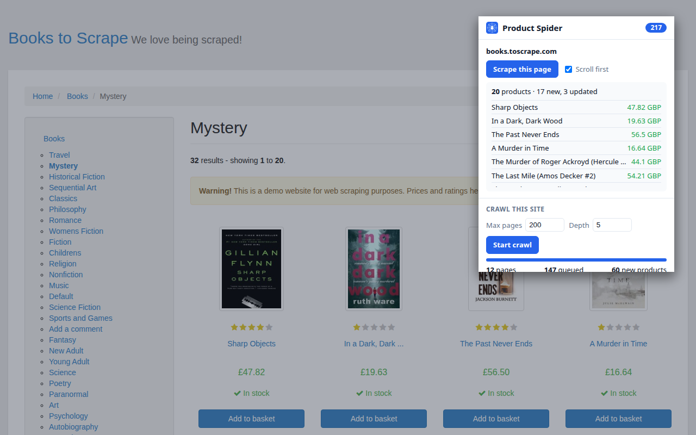
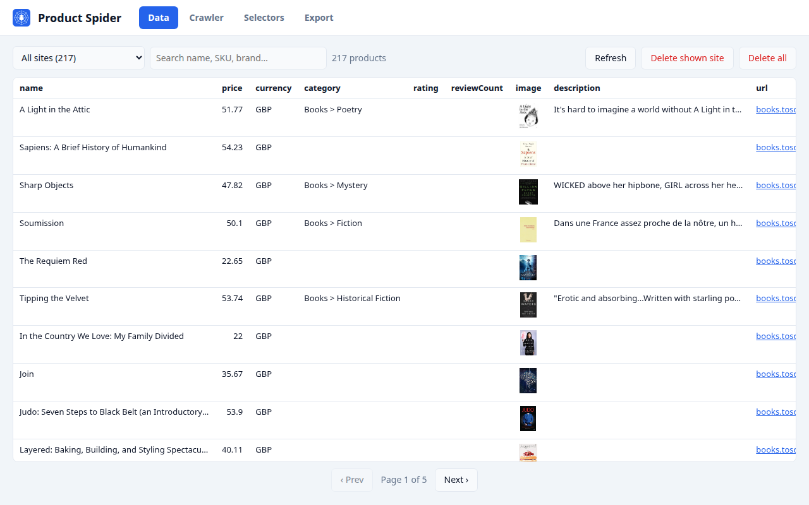
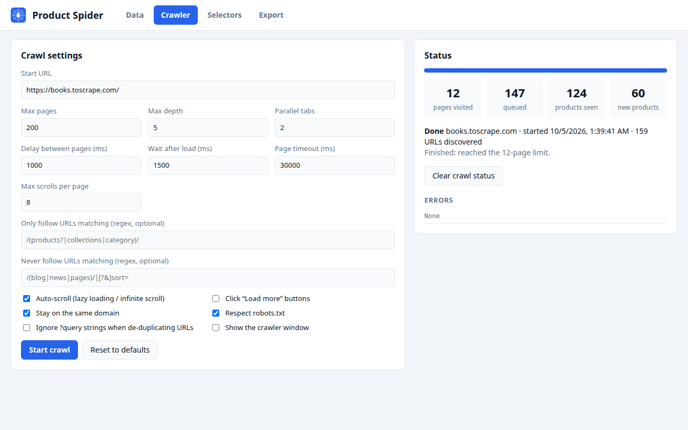
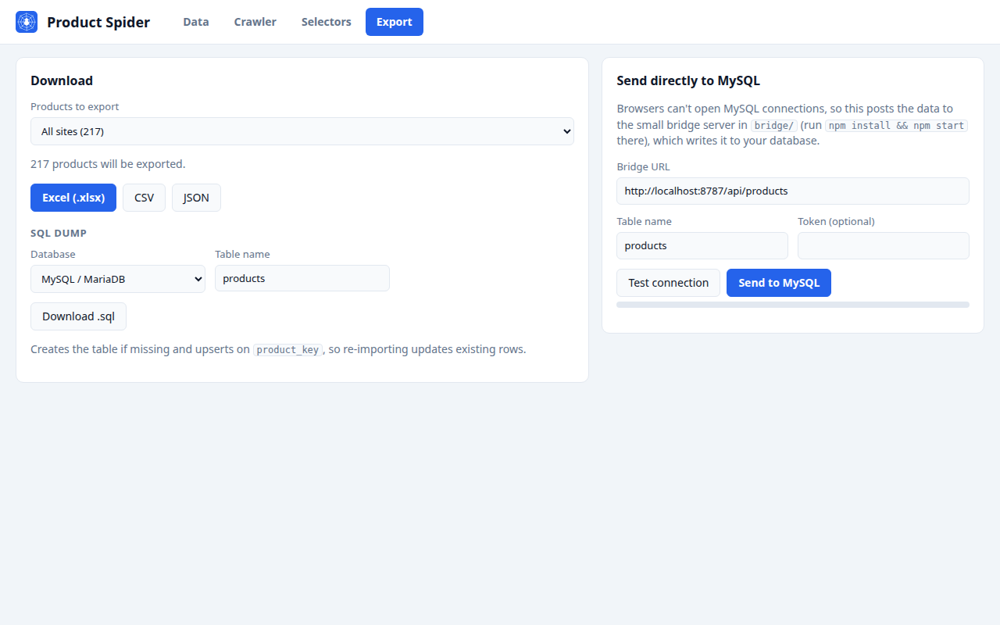
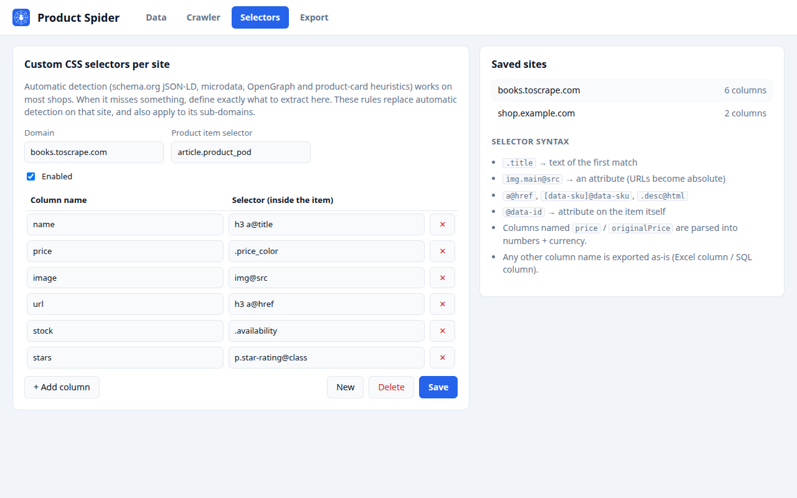
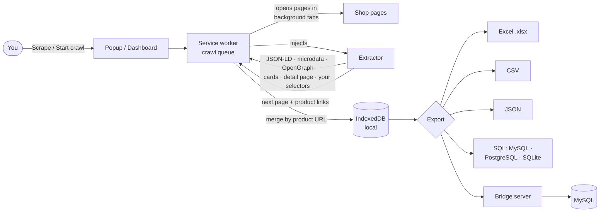

<p align="center">
  
</p>

<p align="center">
  
  
  
  
</p>

# Product Spider

**Product Spider** is a Chrome extension that pulls product data out of online shops: name, price, original price, currency,
SKU, brand, category, stock, rating, images and links. It can scrape a single page or crawl an entire store like a spider,
then export everything to **Excel, CSV, JSON or SQL** (MySQL, PostgreSQL, SQLite), or write it straight into **MySQL**.

It works on most shops without any setup, and lets you define your own CSS selectors for the ones it doesn't handle.

<p align="center">
  
</p>

## Features

- **One-click scraping** of category, search and product pages, including infinite scroll and lazy-loaded images
- **Site crawler** with parallel tabs. It follows pagination first, then product pages, and skips cart, checkout and account pages
- **Automatic detection** using schema.org JSON-LD, microdata, OpenGraph, and product-card and product-page heuristics
- **Price parsing** for many formats and currencies, including Arabic numerals: `١٬٢٩٩٫٥٠ ج.م` → `1299.5 EGP`
- **Smart merging**: a product seen on a listing and on its own page becomes one record with the best data from both
- **Custom CSS selectors per site**, with any extra columns you want
- **Exports**: `.xlsx` with numeric price cells, UTF-8 CSV, JSON, and SQL with `CREATE TABLE` and upserts
- **Direct-to-MySQL** through a small bridge server you run yourself
- **Polite by default**: respects `robots.txt` and `Crawl-delay`, with configurable delays and page limits
- **Private**: everything is stored locally in your browser, with no analytics and no remote servers

## Screenshots

| Browse & search scraped products | Crawl a whole store |
|---|---|
|  |  |
| **Export to Excel, CSV, JSON, SQL or MySQL** | **Custom selectors for any site** |
|  |  |

## Installation

1. Download this repository (**Code → Download ZIP**) and unzip it, or `git clone` it.
2. Open **`chrome://extensions`** and turn on **Developer mode** (top right).
3. Click **Load unpacked** and select the **`product-spider`** folder.
4. Pin the extension from the puzzle-piece menu so its icon stays in the toolbar.

## Usage

### Scrape one page
Open a shop's category or product page, click the **Product Spider** icon, then **Scrape this page**.
Tick **Scroll first** for pages that load more products as you scroll.

### Crawl a whole store
Open the store, click the icon, set **Max pages** and **Depth**, then **Start crawl**.
The crawler works in a separate minimized window. Pause, resume or stop it from the popup or the dashboard.

### Export
Click **Open dashboard & export**, go to the **Export** tab, and pick a format.
To export one store only, choose it in **Products to export**.

### When a site isn't detected well
On the **Selectors** tab, add a rule for the domain: an item selector (one element per product) plus one selector per column.

| Selector | Returns |
|---|---|
| `.title` | text of the first match inside the item |
| `img.main@src` | an attribute; URLs are made absolute |
| `.desc@html` | inner HTML |
| `@data-id` | an attribute of the item element itself |

Columns named `price` or `originalPrice` are parsed into numbers plus `currency`. Any other name becomes its own column.

## How it works



The crawl queue has three priority levels:
1. pagination links (`rel=next`, "Next", `?page=2`, `/page/2/`)
2. product pages
3. everything else

URLs are de-duplicated after removing tracking parameters (`utm_*`, `fbclid`…) and sort/view/filter parameters (`orderby`, `per_page`, `min_price`…),
so the same listing is never crawled twice.

## Output examples

Real output from scraping the first page of [books.toscrape.com](https://books.toscrape.com/), a site built for scraping practice.

**CSV / Excel columns**

```csv
key,name,price,currency,image,url,domain,source,sourcePage,firstSeen,scrapedAt
https://books.toscrape.com/catalogue/a-light-in-the-attic_1000/index.html,A Light in the Attic,51.77,GBP,https://books.toscrape.com/media/cache/2c/da/2cdad67c44b002e7ead0cc35693c0e8b.jpg,https://books.toscrape.com/catalogue/a-light-in-the-attic_1000/index.html,books.toscrape.com,heuristic,https://books.toscrape.com/,2026-10-04T22:48:05.650Z,2026-10-04T22:48:05.650Z
```

**SQL (MySQL)**: the table is created for you, and re-importing updates rows instead of duplicating them

```sql
CREATE TABLE IF NOT EXISTS `products` (
  `id` BIGINT UNSIGNED NOT NULL AUTO_INCREMENT PRIMARY KEY,
  `product_key` VARCHAR(512) NOT NULL,
  `name` TEXT,
  `price` DECIMAL(14,2),
  `currency` VARCHAR(16),
  `image` TEXT,
  `url` TEXT,
  ...
  UNIQUE KEY `uk_product_key` (`product_key`)
) ENGINE=InnoDB DEFAULT CHARSET=utf8mb4 COLLATE=utf8mb4_unicode_ci;

INSERT INTO `products` (`product_key`, `name`, `price`, `currency`, ...) VALUES
('https://books.toscrape.com/catalogue/a-light-in-the-attic_1000/index.html', 'A Light in the Attic', 51.77, 'GBP', ...),
('https://books.toscrape.com/catalogue/its-only-the-himalayas_981/index.html', 'It''s Only the Himalayas', 45.17, 'GBP', ...)
ON DUPLICATE KEY UPDATE `name` = VALUES(`name`), `price` = VALUES(`price`), ...;
```

**JSON**

```json
{
  "name": "A Light in the Attic",
  "price": 51.77,
  "currency": "GBP",
  "image": "https://books.toscrape.com/media/cache/2c/da/2cdad67c44b002e7ead0cc35693c0e8b.jpg",
  "url": "https://books.toscrape.com/catalogue/a-light-in-the-attic_1000/index.html",
  "domain": "books.toscrape.com",
  "source": "heuristic",
  "scrapedAt": "2026-10-04T22:48:05.650Z"
}
```

Richer pages also fill `originalPrice`, `sku`, `gtin`, `brand`, `category`, `availability`, `rating`, `reviewCount`,
`images`, `description` and `specs`.

## Direct to MySQL

Browsers can't open MySQL connections, so [`product-spider/bridge`](product-spider/bridge) has a tiny Node server that receives the data and upserts it:

```bash
cd product-spider/bridge
cp .env.example .env        # set MYSQL_HOST, MYSQL_USER, MYSQL_PASSWORD, MYSQL_DATABASE
npm install
npm start                   # http://localhost:8787
```

Then on the dashboard's **Export** tab, click **Test connection** and then **Send to MySQL**.
The bridge creates the table and adds new columns automatically when you add custom fields.

## Tested on

| Site | Result |
|---|---|
| [books.toscrape.com](https://books.toscrape.com/) | listing pages, pagination and book pages with their spec tables (UPC, product type…) |
| [webscraper.io test shop](https://webscraper.io/test-sites/e-commerce/allinone/computers/laptops) | 117 laptops with full names, prices, ratings and review counts |
| A WooCommerce electronics store (Arabic, EGP) | 266 products from a 40-page crawl, 0 errors; prices verified against the product pages |

## Project structure

```
product-spider/            the extension (load this folder in Chrome)
├── manifest.json
├── background.js          service worker: scraping, crawl queue, tab workers, resume
├── content/extractor.js   runs in pages: detection strategies, links, pagination, auto-scroll
├── lib/                   storage, robots.txt, schema, exporters, .xlsx writer
├── popup/                 toolbar popup
├── dashboard/             full-page dashboard (data, crawler, selectors, export)
└── bridge/                optional Node → MySQL server
dist/                      Chrome Web Store listing text, privacy policy, store images
```

More detail on every setting is in [`product-spider/README.md`](product-spider/README.md).

## Privacy

All scraped data stays in your browser. Nothing is sent to the developer.
See the [privacy policy](dist/PRIVACY.md).

## Responsible use

Product Spider respects `robots.txt` by default and doesn't bypass CAPTCHAs or bot protection.
Keep crawl delays reasonable, and follow each website's terms of service and the data-protection laws that apply to you.
